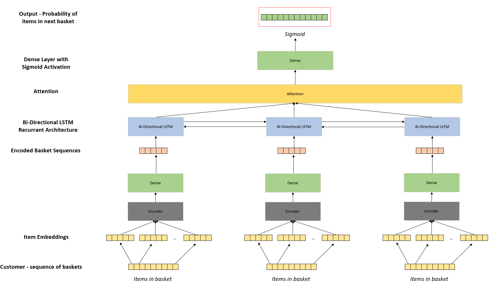
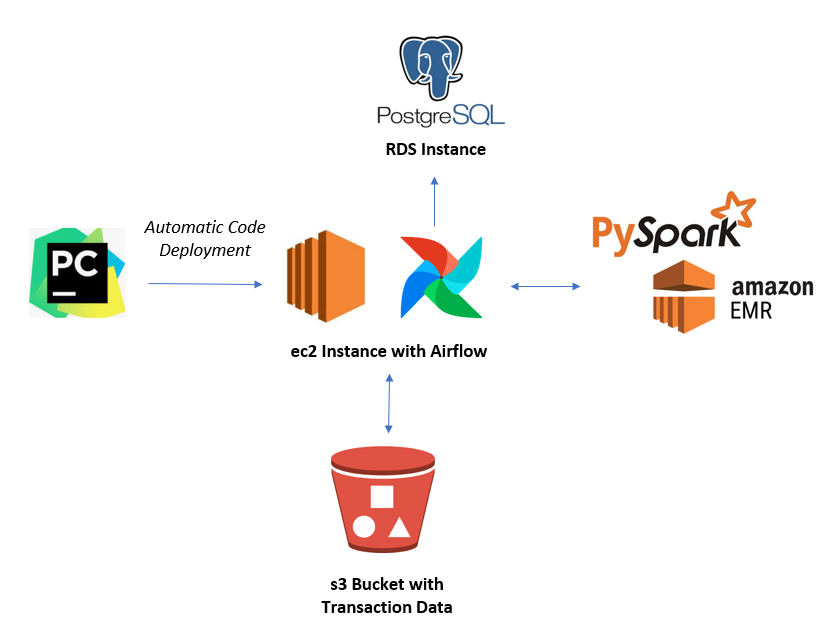
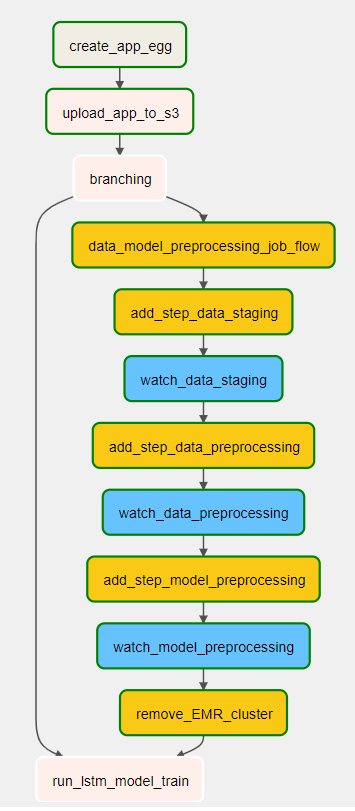

# Generating "next basket" predictions using sequence models

### Project scope

This project contains a pipeline, orchestrated with Airflow, for generating predictions for a customers next basket
using sequence models.  

The initial version of the code utilizes an LSTM model with Attention to generate probabilities that items will be 
found within the customers next transaction.

### Data utilized

The data used for the pipeline was provided open source by Dunnhumby, a global leader in retail analytics. The dataset 
contained a sample of 117 weeks of ‘real’ customer data from a large grocery store constructed to replicate typical 
patterns found in in-store data to allow the development of algorithms in a (near) real-world environment. 

The dataset can be downloaded from the following location:

https://www.dunnhumby.com/careers/engineering/sourcefiles

The actual data utilized was from the “Let’s get sort of real” section, specifically the data from a randomly selected 
group of 5,000 customers.

### Model Details

The next basket prediction model is based on the following architecture:

  

The input data contains sequences of customer baskets.  The model is trained by first converting the items into
embeddings.  A representation of the basket is then generated using average pooling.  This representation of the
basket is then passed through a bi-directional LSTM layer to allow the model to learn from all customer baskets.  

The output of the LSTM layer is passed through an Attention layer and finally to a dense layer with a sigmoid 
activation then calculates the probability that each item will be found in the next basket of the customer sequence.  
The final output of the sequence represents the customers prediction for their next transaction.

The code includes an option to utilize a weighted BCE loss.  This weights the loss in each class to assume a balanced
sample and prevents the algorithm from predicting all 0 (no purchase).  This is recommended due to the extreme 
class imbalance of the problem.  The weighted BCE loss is implemented via a custom loss function as the class_weights
parameter in Keras is implemented for one class or multi-class classification but not for multi-label 
classification problems.

### Infrastructure

The infrastructure utilized in the pipeline is shown in the diagram below:

The decision to utilize Spark was taken as retailer data is typically very large and this use-case requires significant
pre-processing for the prediction model to be trained and items "scored" with a probability of being in the customers
next basket.  As the number of transactions typically runs into millions scaleability quickly becomes an issue with
standard Python libraries.

PyCharm was utilized as the IDE and code was automatically deployed to an ec2 instance with Airflow installed with 
a Postgres RDS instance.  Data was stored in an s3 bucket, data processing and modelling is run with PySpark and
Tensorflow.  

### Airflow Orchestration

In order to run Airflow it was installed on the same EC2 cluster where the code is deployed.  Steps to install Airflow 
using a Postgres database can be found [here](https://medium.com/@abraham.pabbathi/airflow-on-aws-ec2-instance-with-ubuntu-aff8d3206171)

The image below illustrates the orchestration of the pre-processing tasks within Airflow:

  

The DAG contains the following tasks:

**create_app_egg:**  Creates an egg file from the latest code  
**upload_app_to_s3:**  Uploads the application egg and Spark runner files containing the main functions to S3  
**branching:** Decision point to run data pre-processing or skip to model building  
**data_model_preprocessing_job_flow:**  Creates an EMR cluster
**add_step_data_XXX:**  Adds Spark steps for staging data and pre-processing data into output required for modeling  
**watch_stage_XXX:**  Sensors for each staging step to determine when they are complete  
**remove_cluster:**  Terminates the cluster when all steps are completed  
**run_lstm_model_train:**  Runs LSTM model training

### How to run tests

Unit tests have been written with pytest to test functions for data staging, data preprocessing, model pre precessing
and to test the generator used for the LSTM model.  To run the tests navigate to the tests folder (or sub directories
for each test) and run pytest.

### Planned future developments

| Task Type           | Description                                                                                        |
| ------------------- | ---------------------------------------------------------------------------------------------------|
| Model Enhancement   | Add option to use self-attention instead of simple embeddings to generate representation of basket |
| Model Enhancement   | Add customer embedding and additional dense layers to RNN model output                             |
| Model Enhancement   | Add additional embeddings for categorical contextual features e.g. categories in basket            |
