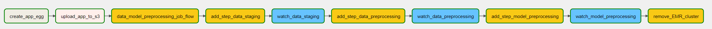

# Generating "next basket" predictions using sequence models

### Project scope

This project contains a pipeline, orchestrated with Airflow, for generating predictions for a customers next basket
using sequence models.  

The initial version of the code utilizes an RNN model to generate probabilities that items will be found within the
customers next transaction.

### Data utilized

The data used for the pipeline was provided open source by Dunnhumby, a global leader in retail analytics. The dataset 
contained a sample of 117 weeks of ‘real’ customer data from a large grocery store constructed to replicate typical 
patterns found in in-store data to allow the development of algorithms in a (near) real-world environment. 

The dataset can be downloaded from the following location:

https://www.dunnhumby.com/careers/engineering/sourcefiles

The actual data utilized was from the “Let’s get sort of real” section, specifically the data from a randomly selected 
group of 5,000 customers.

### Infrastructure

The infrastructure utilized in the pipeline is shown in the diagram below:

The decision to utilize Spark was taken as retailer data is typically very large and this use-case requires significant
pre-processing for the prediction model to be trained and items "scored" with a probability of being in the customers
next basket.  As the number of transactions typically runs into millions scaleability quickly becomes an issue with
standard Python libraries.

PyCharm was utilized as the IDE and code was automatically deployed to an ec2 instance with Airflow installed with 
a Postgres RDS instance.  Data was stored in an s3 bucket, data processing and modelling is run with PySpark and SparkML.  

### Airflow Orchestration

In order to run Airflow it was installed on the same EC2 cluster where the code is deployed.  Steps to install Airflow 
using a Postgres database can be found [here](https://medium.com/@abraham.pabbathi/airflow-on-aws-ec2-instance-with-ubuntu-aff8d3206171)

The image below illustrates the orchestration of the pre-processing tasks within Airflow:

  

The DAG contains the following tasks:

**create_app_egg:**  Creates an egg file from the latest code  
**upload_app_to_s3:**  Uploads the application egg and Spark runner files containing the main functions to S3  
**data_model_preprocessing_job_flow:**  Creates an EMR cluster
**add_step_data_XXX:**  Adds Spark steps for staging data and pre-processing data into output required for modeling  
**watch_stage_XXX:**  Sensors for each staging step to determine when they are complete  
**remove_cluster:**  Terminates the cluster when all steps are completed  

In addition there is a separate DAG for training the LSTM, this has been kept separate to allow it to run independently
of the data preperation.  In future versions this will be updated to allow for model training and / or scoring of
new data.

### Model Details

The next basket prediction model is based on the following architecture:

  

The input data contains sequences of customer baskets.  The model is trained by first converting the items into
embeddings.  A representation of the basket is then generated using average pooling.  This representation of the
basket is then passed through an LSTM layer.  A dense layer with a softmax activation then calculates the probability
that each item will be found in the next basket of the customer sequence.  The final output of the sequence represents
the customers prediction for their next transaction.

### Planned future developments

| Task Type           | Description                                                                                |
| ------------------- | -------------------------------------------------------------------------------------------|
| Testing             | Add unit and integration tests to code base                                                |
| Evaluation          | Add function to calculate *masked* evaluation metrics                                      |
| Scoring             | Add ability to score new customer / transaction sequence files to generate new predictions |
| Model Enhancement   | Add Attention layer to RNN model                                                           |
| Model Enhancement   | Add transformer model and compare to simple RNN                                            |